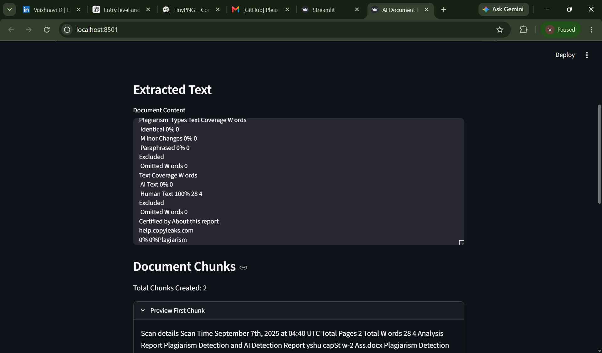
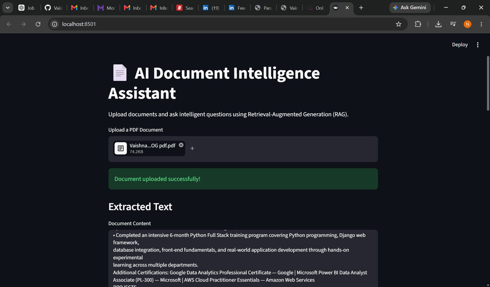
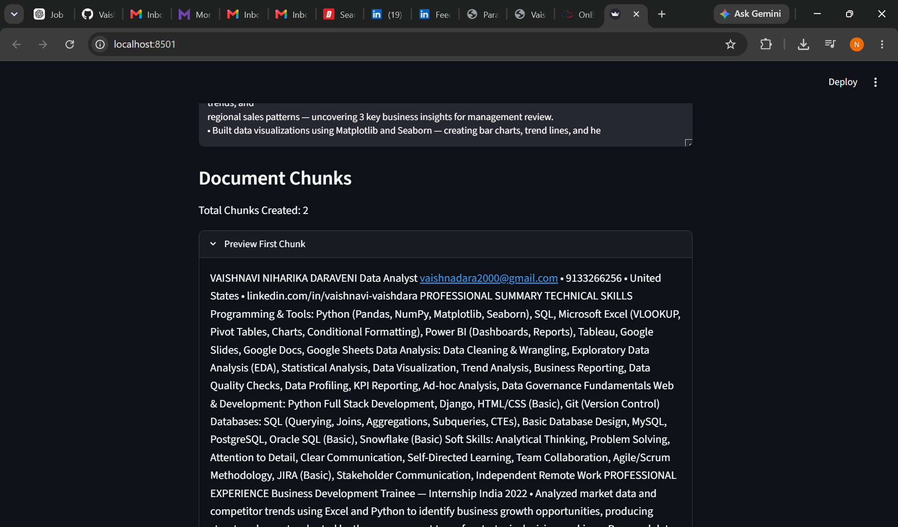
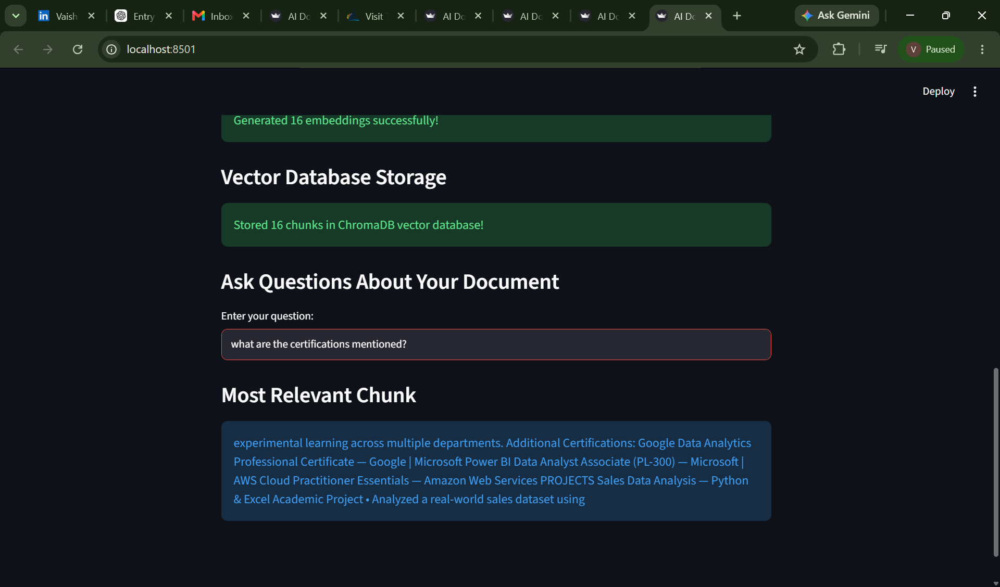
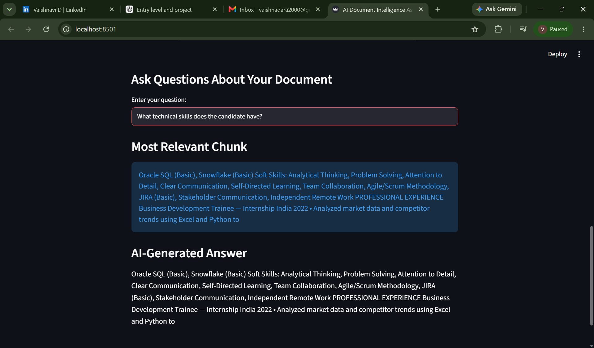
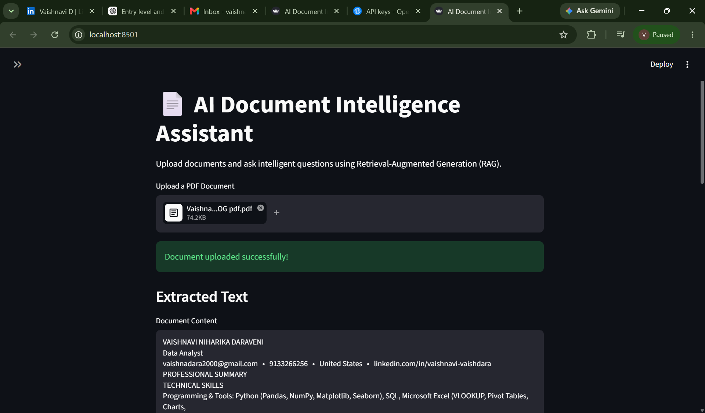
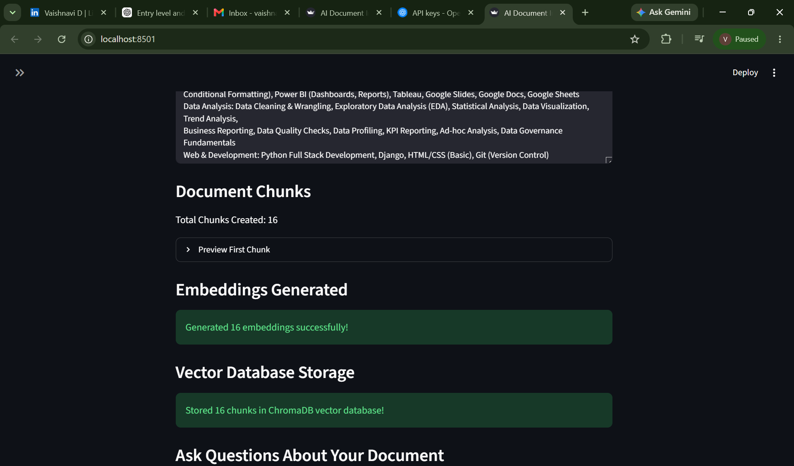
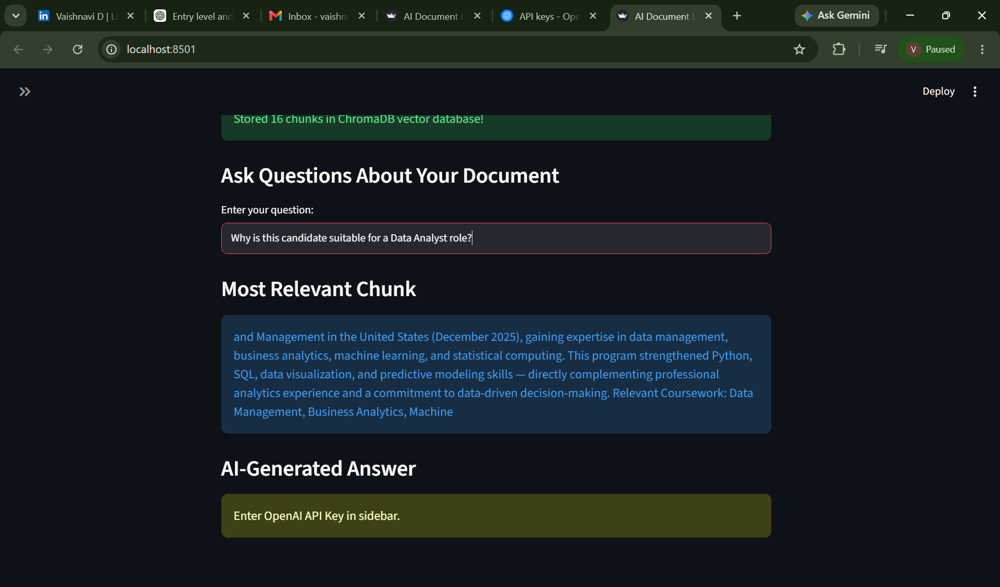

# AI Document Intelligence Assistant

### RAG-Based Document Question Answering System

---

# Project Overview

AI Document Intelligence Assistant is a Retrieval-Augmented Generation (RAG) based application designed to help users interact with PDF documents using Natural Language Processing and Semantic Search techniques.

The application allows users to upload PDF documents, extract textual content, generate vector embeddings, store embeddings inside a vector database, and retrieve relevant information by asking questions in natural language.

The project demonstrates modern AI concepts including Vector Embeddings, Semantic Search, Vector Databases, Information Retrieval, and RAG Architecture.

---

# Problem Statement

Organizations work with large volumes of documents such as:

* Resumes
* Research Papers
* Business Reports
* Technical Documentation
* Policies and Procedures

Finding specific information within lengthy documents can be time-consuming and inefficient.

Traditional keyword search often fails because it relies on exact word matching and cannot understand contextual meaning.

The goal of this project is to create an intelligent document assistant capable of understanding document content and retrieving relevant information based on user intent.

---

# Project Objectives

* Extract information from PDF documents.
* Convert textual information into semantic embeddings.
* Store document knowledge inside a vector database.
* Enable natural language search.
* Retrieve contextually relevant information.
* Demonstrate Retrieval-Augmented Generation (RAG) workflow.

---

# Technologies Used

### Programming Language

* Python

### Front-End

* Streamlit

### PDF Processing

* PyPDF

### Natural Language Processing

* Sentence Transformers

### Vector Database

* ChromaDB

### AI Concepts

* Vector Embeddings
* Semantic Search
* Information Retrieval
* Retrieval-Augmented Generation (RAG)

---

# System Architecture

PDF Upload

↓

Text Extraction

↓

Document Chunking

↓

Embedding Generation

↓

ChromaDB Vector Storage

↓

User Query

↓

Semantic Search

↓

Relevant Context Retrieval

↓

Answer Generation

---

# Project Workflow

## Step 1: PDF Upload

The user uploads a PDF document through the Streamlit user interface.

The uploaded document becomes the knowledge source for the application.

## Step 2: Text Extraction

The application uses PyPDF to extract text from each page of the uploaded PDF.

Extracted text is stored for further processing.

### Key Functionality

* Reads PDF pages
* Extracts textual content
* Combines all pages into a single document

## Step 3: Document Chunking

Large documents are divided into smaller chunks.

Chunking improves retrieval accuracy and reduces embedding complexity.

### Benefits

* Faster processing
* Better retrieval quality
* Improved semantic search performance

---

---

## Step 4: Embedding Generation

Sentence Transformers convert document chunks into numerical vector representations called embeddings.

These embeddings capture semantic meaning rather than exact keywords.

### Model Used

all-MiniLM-L6-v2

### Output

* Semantic vectors
* Numerical document representation

## Step 5: Vector Database Storage

Generated embeddings are stored in ChromaDB.

The vector database enables efficient similarity search operations.

### Features

* Embedding storage
* Fast retrieval
* Similarity comparison

---

### ChromaDB Initialization

### Storing Document Chunks

### Successful Vector Database Creation

---

## Step 6: Semantic Search

When a user asks a question:

* The question is converted into an embedding.
* ChromaDB compares it with stored document embeddings.
* The most relevant chunk is retrieved.

### Example Questions

* What skills are mentioned?
* What certifications are listed?
* Summarize this document.
* What projects are included?

---

---

## Step 7: Question Answering

The retrieved document chunk is displayed as the answer.

The application returns contextually relevant information based on semantic similarity.

### Sample Output

Question:

"What technical skills does the candidate have?"

Retrieved Answer:

Python, SQL, Power BI, Tableau, Excel, Snowflake, Data Analysis, Data Visualization.

---

---

## Step 8: AI-Powered Answer Generation

After retrieving the most relevant document chunk, the application generates a context-aware response using the retrieved information.

Instead of returning raw document text, the system provides a structured and meaningful answer based on the user's question and the retrieved context.

### Example 1 – Certification Query

**Screenshot Name:** Phase8_RAG_Answer.png

The application identifies certification-related information from the document and generates a concise answer.

---

### Example 2 – Technical Skills Query

**Screenshot Name:** Phase8_RAG_Answer2.png

The application analyzes the retrieved content and summarizes the candidate's technical skills.

---

### Example 3 – Candidate Evaluation Query

**Screenshot Name:** Phase8_RAG_Answer3.png

The application evaluates the candidate profile and generates a professional response based on the document content.

---

### Result

- Context-aware answer generation
- Improved user experience
- Natural language responses
- End-to-end RAG workflow
- AI-assisted document understanding

# Challenges Faced

## Challenge 1

Sentence Transformer installation issues.

### Resolution

Installed required dependencies and configured the environment correctly.

---

## Challenge 2

Embedding generation errors.

### Resolution

Validated model loading and optimized chunk processing.

---

## Challenge 3

Vector database integration.

### Resolution

Successfully integrated ChromaDB and verified retrieval functionality.

---

## Challenge 4

Semantic retrieval accuracy.

### Resolution

Reduced chunk size and improved document segmentation.

---

# Skills Demonstrated

### Artificial Intelligence

* Retrieval-Augmented Generation (RAG)
* Semantic Search
* Vector Embeddings
* Information Retrieval

### NLP

* Text Processing
* Document Chunking
* Embedding Models
* Sentence Transformers

### Development

* Python
* Streamlit
* ChromaDB
* PyPDF

### Data Engineering Concepts

* Vector Databases
* Embedding Pipelines
* Document Processing

---

# Business Impact

This solution can be applied to:

* Enterprise Knowledge Management
* Resume Search Systems
* Research Document Analysis
* Policy Retrieval Systems
* Customer Support Knowledge Bases
* Internal Document Assistants

---

# Future Enhancements

### Planned Improvements

* Multi-document support
* OpenAI/GPT integration
* Conversational memory
* Document summarization
* Cloud deployment
* Source citation tracking
* DOCX support
* Multi-user access

---

# Author

Vaishnavi Niharika Daraveni

Data Analyst | Python | SQL | Power BI | RAG | NLP | AI Applications
